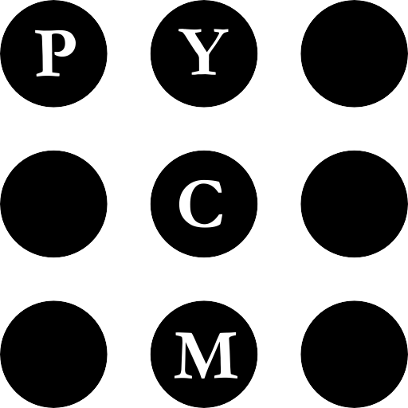
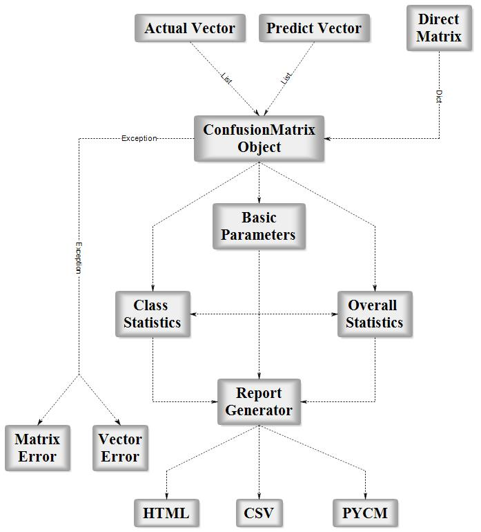

<div align="center">

<br/>
<br/>
<a href="https://www.python.org/"></a>
<a href="/Document"></a>
<a href="https://travis-ci.org/sepandhaghighi/pycm"></a>
<a href="https://ci.appveyor.com/project/sepandhaghighi/pycm"></a>
<a href="https://codecov.io/gh/sepandhaghighi/pycm">
  
</a>
<a class="badge-align" href="https://www.codacy.com/app/sepand-haghighi/pycm?utm_source=github.com&amp;utm_medium=referral&amp;utm_content=sepandhaghighi/pycm&amp;utm_campaign=Badge_Grade"></a>
<a href="https://badge.fury.io/py/pycm"></a>
<a href="https://www.openhub.net/p/pycm"></a>
</div>

----------
## Table of contents					
   * [Overview](#overview)
   * [Installation](#installation)
   * [Usage](#usage)
   * [Issues & Bug Reports](#issues--bug-reports)
   * [Todo](#todo)
   * [Outputs](#outputs)
   * [Dependencies](#dependencies)
   * [Contribution](#contribution)
   * [References](#references)
   * [Cite](#cite)
   * [Authors](AUTHORS.md)
   * [License](#license)
   * [Donate](#donate-to-our-project)
   * [Changelog](CHANGELOG.md)

## Overview

<p align="justify">	
In the field of machine learning and specifically the problem of statistical classification, a confusion matrix, also known as an error matrix, is a specific table layout that allows visualization of the performance of an algorithm, typically a supervised learning one (in unsupervised learning it is usually called a matching matrix). Each row of the matrix represents the instances in a predicted class while each column represents the instances in an actual class (or vice versa)		
pycm(python confusion matrix) is a multi-class confusion matrix library in python.

</p>

<div align="center">

<p>Fig1. PYCM Block Diagram</p>
</div>


## Installation		

### Source Code
- Download [Version 0.8](https://github.com/sepandhaghighi/pycm/archive/v0.8.zip) or [Latest Source ](https://github.com/sepandhaghighi/pycm/archive/master.zip)
- Run `pip install -r requirements.txt` or `pip3 install -r requirements.txt` (Need root access)
- Run `python3 setup.py install` or `python setup.py install` (Need root access)				

### PyPI


- Check [Python Packaging User Guide](https://packaging.python.org/installing/)     
- Run `pip install pycm` or `pip3 install pycm` (Need root access)

### Easy Install

- Run `easy_install --upgrade pycm` (Need root access)

## Usage

### From Vector
```python
>>> from pycm import *
>>> y_actu = [2, 0, 2, 2, 0, 1, 1, 2, 2, 0, 1, 2] # or y_actu = numpy.array([2, 0, 2, 2, 0, 1, 1, 2, 2, 0, 1, 2])
>>> y_pred = [0, 0, 2, 1, 0, 2, 1, 0, 2, 0, 2, 2] # or y_pred = numpy.array([0, 0, 2, 1, 0, 2, 1, 0, 2, 0, 2, 2])
>>> cm = ConfusionMatrix(y_actu, y_pred) # Create CM From Data
>>> cm.classes
[0, 1, 2]
>>> cm.table
{0: {0: 3, 1: 0, 2: 0}, 1: {0: 0, 1: 1, 2: 2}, 2: {0: 2, 1: 1, 2: 3}}
>>> print(cm)
Predict          0        1        2        
Actual
0                3        0        0        
1                0        1        2        
2                2        1        3        


Overall Statistics : 

95% CI                                                           (0.30439,0.86228)
Bennett_S                                                        0.375
Chi-Squared                                                      6.6
Chi-Squared DF                                                   4
Conditional Entropy                                              0.95915
Cramer_V                                                         0.5244
Cross Entropy                                                    1.59352
Gwet_AC1                                                         0.38931
Joint Entropy                                                    2.45915
KL Divergence                                                    0.09352
Kappa                                                            0.35484
Kappa 95% CI                                                     (-0.07708,0.78675)
Kappa No Prevalence                                              0.16667
Kappa Standard Error                                             0.22036
Kappa Unbiased                                                   0.34426
Lambda A                                                         0.16667
Lambda B                                                         0.42857
Mutual Information                                               0.52421
Overall_ACC                                                      0.58333
Overall_RACC                                                     0.35417
Overall_RACCU                                                    0.36458
PPV_Macro                                                        0.56667
PPV_Micro                                                        0.58333
Phi-Squared                                                      0.55
Reference Entropy                                                1.5
Response Entropy                                                 1.48336
Scott_PI                                                         0.34426
Standard Error                                                   0.14232
Strength_Of_Agreement(Altman)                                    Fair
Strength_Of_Agreement(Cicchetti)                                 Poor
Strength_Of_Agreement(Fleiss)                                    Poor
Strength_Of_Agreement(Landis and Koch)                           Fair
TPR_Macro                                                        0.61111
TPR_Micro                                                        0.58333

Class Statistics :

Classes                                                          0                       1                       2                       
ACC(Accuracy)                                                    0.83333                 0.75                    0.58333                 
BM(Informedness or bookmaker informedness)                       0.77778                 0.22222                 0.16667                 
DOR(Diagnostic odds ratio)                                       None                    4.0                     2.0                     
ERR(Error rate)                                                  0.16667                 0.25                    0.41667                 
F0.5(F0.5 score)                                                 0.65217                 0.45455                 0.57692                 
F1(F1 score - harmonic mean of precision and sensitivity)        0.75                    0.4                     0.54545                 
F2(F2 score)                                                     0.88235                 0.35714                 0.51724                 
FDR(False discovery rate)                                        0.4                     0.5                     0.4                     
FN(False negative/miss/type 2 error)                             0                       2                       3                       
FNR(Miss rate or false negative rate)                            0.0                     0.66667                 0.5                     
FOR(False omission rate)                                         0.0                     0.2                     0.42857                 
FP(False positive/type 1 error/false alarm)                      2                       1                       2                       
FPR(Fall-out or false positive rate)                             0.22222                 0.11111                 0.33333                 
G(G-measure geometric mean of precision and sensitivity)         0.7746                  0.40825                 0.54772                 
LR+(Positive likelihood ratio)                                   4.5                     3.0                     1.5                     
LR-(Negative likelihood ratio)                                   0.0                     0.75                    0.75                    
MCC(Matthews correlation coefficient)                            0.68313                 0.2582                  0.16903                 
MK(Markedness)                                                   0.6                     0.3                     0.17143                 
N(Condition negative)                                            9                       9                       6                       
NPV(Negative predictive value)                                   1.0                     0.8                     0.57143                 
P(Condition positive)                                            3                       3                       6                       
POP(Population)                                                  12                      12                      12                      
PPV(Precision or positive predictive value)                      0.6                     0.5                     0.6                     
PRE(Prevalence)                                                  0.25                    0.25                    0.5                     
RACC(Random accuracy)                                            0.10417                 0.04167                 0.20833                 
RACCU(Random accuracy unbiased)                                  0.11111                 0.0434                  0.21007                 
TN(True negative/correct rejection)                              7                       8                       4                       
TNR(Specificity or true negative rate)                           0.77778                 0.88889                 0.66667                 
TON(Test outcome negative)                                       7                       10                      7                       
TOP(Test outcome positive)                                       5                       2                       5                       
TP(True positive/hit)                                            3                       1                       3                       
TPR(Sensitivity, recall, hit rate, or true positive rate)        1.0                     0.33333                 0.5  

>>> cm.matrix()
Predict          0        1        2        
Actual
0                3        0        0        
1                0        1        2        
2                2        1        3        

>>> cm.normalized_matrix()
Predict          0              1              2              
Actual
0                1.0            0.0            0.0            
1                0.0            0.33333        0.66667        
2                0.33333        0.16667        0.5            

```
### Direct CM
```python
>>> from pycm import *
>>> cm2 = ConfusionMatrix(matrix={"Class1": {"Class1": 1, "Class2":2}, "Class2": {"Class1": 0, "Class2": 5}}) # Create CM Directly
>>> cm2
pycm.ConfusionMatrix(classes: ['Class1', 'Class2'])
>>> print(cm2)
Predict          Class1   Class2   
Actual
Class1           1        2        
Class2           0        5        


Overall Statistics : 

95% CI                                                           (0.44994,1.05006)
Bennett_S                                                        0.5
Chi-Squared                                                      None
Chi-Squared DF                                                   1
Conditional Entropy                                              None
Cramer_V                                                         None
Cross Entropy                                                    1.2454
Gwet_AC1                                                         0.6
Joint Entropy                                                    None
KL Divergence                                                    0.29097
Kappa                                                            0.38462
Kappa 95% CI                                                     (-0.354,1.12323)
Kappa No Prevalence                                              0.5
Kappa Standard Error                                             0.37684
Kappa Unbiased                                                   0.33333
Lambda A                                                         None
Lambda B                                                         None
Mutual Information                                               None
Overall_ACC                                                      0.75
Overall_RACC                                                     0.59375
Overall_RACCU                                                    0.625
PPV_Macro                                                        0.85714
PPV_Micro                                                        0.75
Phi-Squared                                                      None
Reference Entropy                                                0.95443
Response Entropy                                                 0.54356
Scott_PI                                                         0.33333
Standard Error                                                   0.15309
Strength_Of_Agreement(Altman)                                    Fair
Strength_Of_Agreement(Cicchetti)                                 Poor
Strength_Of_Agreement(Fleiss)                                    Poor
Strength_Of_Agreement(Landis and Koch)                           Fair
TPR_Macro                                                        0.66667
TPR_Micro                                                        0.75

Class Statistics :

Classes                                                          Class1                  Class2                  
ACC(Accuracy)                                                    0.75                    0.75                    
BM(Informedness or bookmaker informedness)                       0.33333                 0.33333                 
DOR(Diagnostic odds ratio)                                       None                    None                    
ERR(Error rate)                                                  0.25                    0.25                    
F0.5(F0.5 score)                                                 0.71429                 0.75758                 
F1(F1 score - harmonic mean of precision and sensitivity)        0.5                     0.83333                 
F2(F2 score)                                                     0.38462                 0.92593                 
FDR(False discovery rate)                                        0.0                     0.28571                 
FN(False negative/miss/type 2 error)                             2                       0                       
FNR(Miss rate or false negative rate)                            0.66667                 0.0                     
FOR(False omission rate)                                         0.28571                 0.0                     
FP(False positive/type 1 error/false alarm)                      0                       2                       
FPR(Fall-out or false positive rate)                             0.0                     0.66667                 
G(G-measure geometric mean of precision and sensitivity)         0.57735                 0.84515                 
LR+(Positive likelihood ratio)                                   None                    1.5                     
LR-(Negative likelihood ratio)                                   0.66667                 0.0                     
MCC(Matthews correlation coefficient)                            0.48795                 0.48795                 
MK(Markedness)                                                   0.71429                 0.71429                 
N(Condition negative)                                            5                       3                       
NPV(Negative predictive value)                                   0.71429                 1.0                     
P(Condition positive)                                            3                       5                       
POP(Population)                                                  8                       8                       
PPV(Precision or positive predictive value)                      1.0                     0.71429                 
PRE(Prevalence)                                                  0.375                   0.625                   
RACC(Random accuracy)                                            0.04688                 0.54688                 
RACCU(Random accuracy unbiased)                                  0.0625                  0.5625                  
TN(True negative/correct rejection)                              5                       1                       
TNR(Specificity or true negative rate)                           1.0                     0.33333                 
TON(Test outcome negative)                                       7                       1                       
TOP(Test outcome positive)                                       1                       7                       
TP(True positive/hit)                                            1                       5                       
TPR(Sensitivity, recall, hit rate, or true positive rate)        0.33333                 1.0                     

```
				

For more information visit [here](/Document "Document")

<div align="center">

<a href="https://asciinema.org/a/163517" target="_blank"></a>

</div>

## Issues & Bug Reports			

Just fill an issue and describe it. We'll check it ASAP!							
or send an email to [shaghighi@ce.sharif.edu](mailto:shaghighi@ce.sharif.edu "shaghighi@ce.sharif.edu"). 


## Todo	
- [x] Basic
  - [x] TP
  - [x] FP
  - [x] FN
  - [x] TN
  - [x] Population
  - [x] Condition positive
  - [x] Condition negative 
  - [x] Test outcome positive
  - [x] Test outcome negative
- [x] Class Statistics
  - [x] ACC
  - [x] ERR
  - [x] BM
  - [x] DOR
  - [x] F1-Score
  - [x] FDR
  - [x] FNR
  - [x] FOR
  - [x] FPR
  - [x] LR+
  - [x] LR-
  - [x] MCC
  - [x] MK
  - [x] NPV
  - [x] PPV
  - [x] TNR
  - [x] TPR
  - [x] Prevalence
  - [x] G-measure
  - [x] RACC
- [x] Outputs
  - [x] CSV File
  - [x] HTML File
  - [x] Output File
  - [x] Table
  - [x] Normalized Table
- [x] Overall Statistics
  - [x] CI
  - [x] Chi-Squared
  - [x] Phi-Squared
  - [x] Cramer's V
  - [x] Kappa
  - [x] Kappa Unbiased
  - [x] Kappa No Prevalence
  - [ ] Aickin's alpha
  - [x] Bennett S score
  - [x] Gwet's AC1
  - [x] Scott's pi
  - [ ] Krippendorff's alpha
  - [x] Goodman and Kruskal's lambda A
  - [x] Goodman and Kruskal's lambda B
  - [x] Kullback-Liebler divergence
  - [x] Entropy
  - [x] Overall ACC
  - [x] Strength of Agreement
    - [x] Landis and Koch
    - [x] Fleiss
    - [x] Altman
    - [x] Cicchetti 
  - [x] TPR Micro/Macro
  - [x] PPV Micro/Macro

## Outputs	

1. [HTML](http://www.shaghighi.ir/pycm/test.html)
2. [CSV](Otherfiles/test.csv)
3. [PYCM](Otherfiles/test.pycm)			


## Dependencies

<a href="https://requires.io/github/sepandhaghighi/pycm/requirements/?branch=dev"></a>

## Contribution			

Changes and improvements are more than welcome! ❤️ Feel free to fork and open a pull request. Please make your changes in a specific branch and request to pull into `dev` 			

Remember to write a few tests for your code before sending pull requests. 


## References			

<blockquote>1- Landis JR, Koch GG. The measurement of observer agreement for categorical data. Biometrics 1977; 33:159–174 </blockquote>

<blockquote>2- Powers, D. M. W. (2011). Evaluation: from precision, recall and f-measure to roc, informedness, markedness & correlation. Journal of Machine Learning Technologies.</blockquote>


<blockquote>3-  C. Sammut, G. Webb, Encyclopedia of Machine Learning. Springer, 2011. Springer reference.</blockquote>

<blockquote>4- Fleiss, J. L. (1971). Measuring nominal scale agreement among many raters. Psychological Bulletin, 76(5), 378-382.
http://dx.doi.org/10.1037/h0031619</blockquote>

<blockquote>5- Altman D.G. 1991. Practical Statistics for Medical Research.
Chapman and Hall, London.</blockquote>

<blockquote>6- Gwet, K. L. (2008). Computing inter-rater reliability and its variance in the presence of high agreement. The British Journal of Mathematical and Statistical Psychology, 61(1), 29–48.</blockquote>

<blockquote>7- Scott, W. A. (1955). Reliability of content analysis: The case of nominal scaling. Public Opinion Quarterly, 19(3), 321–325.</blockquote>

<blockquote>8- Bennett, E. M., Alpert, R., & Goldstein, A. C. (1954). Communication through limited response questioning. The Public Opinion Quarterly, 18(3), 303–308.</blockquote>

<blockquote>9- Cicchetti, Domenic V. (1994). "Guidelines, criteria, and rules of thumb for evaluating normed and standardized assessment instruments in psychology". Psychological Assessment. 6 (4): 284–290.
 doi:10.1037/1040-3590.6.4.284</blockquote>

<blockquote>10- Davies, R.B. (1980). "Algorithm AS155: The Distributions of a Linear Combination of χ2 Random Variables". Journal of the Royal Statistical Society. 29 (3): 323–333.
 doi:10.2307/2346911.</blockquote>

<blockquote>11-  Kullback, S.; Leibler, R.A. (1951). "On information and sufficiency". Annals of Mathematical Statistics. 22 (1): 79–86. doi:10.1214/aoms/1177729694</blockquote>

<blockquote>12- Goodman, Leo A.; Kruskal, William H. (1972). "Measures of Association for Cross Classifications, IV: Simplification of Asymptotic Variances". Journal of the American Statistical Association. 67 (338): 415–421. doi:10.1080/01621459.1972.10482401</blockquote>

<blockquote>13- Goodman, L.A., Kruskal, W.H. (1963) "Measures of Association for Cross Classifications III: Approximate Sampling Theory", Journal of the American Statistical Association,
 58, 310–364. JSTOR 2283271 doi:10.1080/01621459.1963.10500850 </blockquote>

<blockquote>14- Byrt, Ted, Janet Bishop and John B. Carlin. 1993. Bias, prevalence, and kappa. Journal of Clinical Epidemiology 46(5):423-429. </blockquote>

<blockquote>15- Shepperd, M., Bowes, D. and Hall, T. (2014). Researcher Bias: The Use of Machine Learning in Software Defect Prediction. IEEE Transactions on Software Engineering, 40(6), pp.603-616.</blockquote>

<blockquote>16- Deng, X., Liu, Q., Deng, Y. and Mahadevan, S. (2016). An improved method to construct basic probability assignment based on the confusion matrix for classification problem. Information Sciences, 340-341, pp.250-261.</blockquote>


## Cite

If you use pycm in your research , please cite this :

<pre>
Sepand Haghighi, Masoomeh Jasemi, and Shaahin Hessabi. “Pycm : Multi Class Confusion Matrix Library in Python”. Zenodo, January 22, 2018. doi:10.5281/zenodo.1157173.
</pre>
<pre>

@misc{https://doi.org/10.5281/zenodo.1157173,
  doi = {10.5281/zenodo.1157173},
  author = {{Sepand Haghighi} and Jasemi,  Masoomeh and {Shaahin Hessabi}},
  keywords = {Machine Learning,  statistics,  confusion-matrix,  statistical-analysis,  matrices,  matrix},
  title = {Pycm : Multi Class Confusion Matrix Library In Python},
  pages = {--},
  publisher = {Zenodo},
  year = {2018}
}


</pre>
<a href="https://zenodo.org/badge/latestdoi/118506495"></a>

## License

<a href="https://github.com/sepandhaghighi/pycm/blob/master/LICENSE"></a>


## Donate to our project
								
<h3>Bitcoin :</h3>					

```12Xm1qL4MXYWiY9sRMoa3VpfTfw6su3vNq```			


<h3>Payping (For Iranian citizens) :</h3>

<a href="http://www.payping.net/sepandhaghighi" target="__blank"></a>
