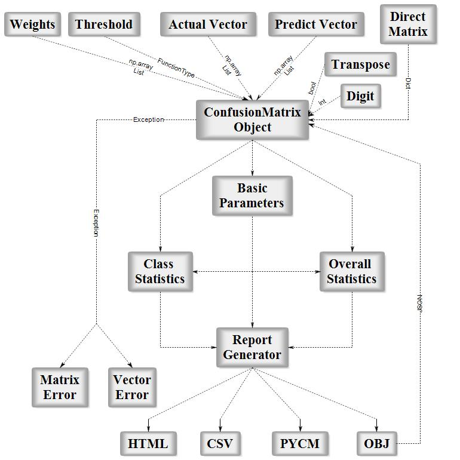

						

# Summary			
			
In the field of machine learning and specifically for statistical classification a confusion matrix - also known as error matrix - is a specific table layout that allows visualization of the algorithm performance, and is mostly used in supervised learning. Each row of the matrix represents the instances in an actual class, while each column represents the instances in a predict class (or vice versa)[@Powers2011; @Sammut2010; @Shepperd2014; @Deng2016].			

 				

PyCM is a multi-class confusion matrix library written in python that supports both input data vectors and direct matrix, and a proper tool for post-classification model evaluation that supports most classes and overall statistics parameters[@Landis1977; @Fleiss1971; @Altman1990; @Gwet2008; @Scott1955; @Bennett1954; @Cicchetti1994; @Davies1980; @Kullback1951; @Goodman1972; @Goodman1963; @Byrt1993].			

We can categorize these statistics in 3 sections: 			

1. Basic 
2. Class Statistics			
3. Overall Statistics

PyCM is also capable of generating report in HTML, CSV and .pycm formats.

To sum it up, PyCM is the swiss-army knife of confusion matrices, targeted mainly at data scientists that need a broad array of metrics for predictive models and an accurate evaluation of large variety of classifiers.[@Haghighi2018]	

# References
